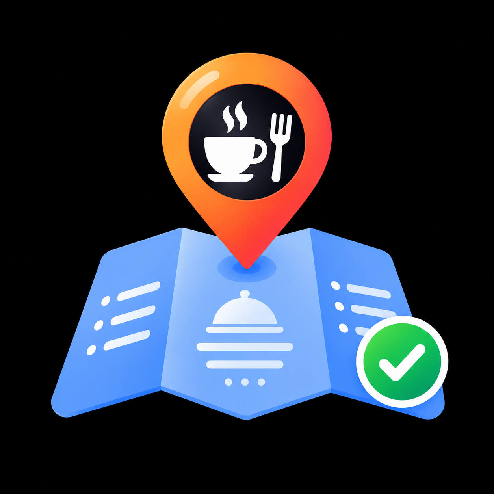

<p align="center">
  
</p>

<h1 align="center">Woo Restaurant Cafe Menu</h1>

<p align="center">
  Turn your WooCommerce categories into a fast, beautiful restaurant / cafe menu —<br>
  loaded with AJAX and fully isolated from your theme.
</p>

<p align="center">
  
  
  
  
  
</p>

---

## Overview

**Woo Restaurant Cafe Menu** builds a digital menu out of the products and categories you already manage in WooCommerce. Pick the categories you want, set your colors and logo, and publish — either as a **shortcode** inside any page, or as a **standalone full-page menu** that ignores your theme completely.

It is a good fit for cafes, restaurants, food trucks, and any shop that wants a clean "scan the QR code and browse the menu" experience.

## Features

- **Built on WooCommerce** — uses your existing products, prices, images, and categories. No duplicate data entry.
- **AJAX category switching** — customers move between categories instantly, without page reloads.
- **Parent / child categories** — organize the menu into sections and sub-sections.
- **Two ways to display it**
  - Shortcode: `[wrmp_menu]`
  - Dedicated standalone page, created for you with one click.
- **Theme-isolated standalone page** — renders without your theme's header/footer and dequeues theme and third-party frontend styles/scripts, so nothing else can break the layout. Only this plugin's layout and WooCommerce essentials are loaded.
- **Full visual control from the settings page**
  - Primary, secondary, background, and text colors
  - Separate colors for category cards (active, inactive, hover) and product cards (background, name, price, description)
  - Logo with independent desktop and mobile sizes
  - Product image height: fixed (cropped) or auto (full image, no cropping), with separate desktop and mobile heights
- **Contact info** — Instagram ID and phone number shown on the menu.
- **Mobile-first and responsive.**
- **Translation ready** — includes a `.pot` template and a complete Persian (`fa_IR`) translation.
- **Clean uninstall** — settings are removed when the plugin is deleted.

## Requirements

| Requirement | Version |
|---|---|
| WordPress | 5.8 or higher |
| PHP | 7.4 or higher |
| WooCommerce | Active (any recent version) |

## Installation

### From GitHub

1. Download the latest release ZIP from the [Releases](../../releases) page, or clone the repository:
   ```bash
   cd wp-content/plugins
   git clone https://github.com/YOUR-USERNAME/woo-resturant-cafe-menu.git
   ```
2. In WordPress, go to **Plugins → Add New → Upload Plugin** and upload the ZIP (skip this step if you cloned).
3. Make sure **WooCommerce** is installed and active.
4. Activate **Woo Resturant Cafe Menu**.

> The plugin folder must be named `woo-resturant-cafe-menu` so translations load correctly.

## Quick Start

1. Create your product categories in WooCommerce (for example *Coffee → Espresso, Latte* and *Desserts → Cakes, Ice Cream*) and assign products to them.
2. Open **Restaurant Menu** in the WordPress admin sidebar.
3. Set your restaurant name, logo, and colors.
4. Under **Menu Source**, tick the categories that should appear in the menu.
5. Under **Menu Page**, enable the dedicated menu page and click **Create / Refresh Menu Page**.
6. Click **View selected page** — your menu is live.

## Usage

### Shortcode

Place this on any page or post:

```
[wrmp_menu]
```

| Attribute | Values | Default | Description |
|---|---|---|---|
| `show_title` | `yes` / `no` | `yes` | Show or hide the menu title. |

Example:

```
[wrmp_menu show_title="no"]
```

### Dedicated standalone page

Enable **Dedicated Menu Page** in the settings and click **Create / Refresh Menu Page**. The plugin maintains a WordPress page for you and renders it as a clean, full-screen menu with no theme header, footer, or sidebar. This is ideal for linking from a QR code.

## Settings Reference

| Section | What you can configure |
|---|---|
| **General Settings** | Restaurant name, logo, primary/secondary/background/text colors, Instagram ID, phone number |
| **Sizes** | Logo width/height (desktop and mobile), product image height mode (fixed or auto) and heights |
| **Card Styles** | Category card colors (active, inactive, hover) and product card colors (background, text, name, price, description) |
| **Menu Source** | Which WooCommerce product categories appear in the menu |
| **Menu Page** | Enable and manage the dedicated standalone menu page |

Default theme: deep navy background (`#0d1b2a`) with teal accents (`#1b9aaa`).

## Translations

| Language | Status |
|---|---|
| English | Default |
| Persian (`fa_IR`) | Included |

Translation files live in [`languages/`](languages/). To add a language, copy `woo-resturant-cafe-menu.pot` into a translation tool such as [Poedit](https://poedit.net/) or Loco Translate, then save the `.po`/`.mo` files as `woo-resturant-cafe-menu-<locale>.po/.mo`.

## Project Structure

```
woo-resturant-cafe-menu/
├── woo-resturant-cafe-menu.php      # Plugin bootstrap
├── uninstall.php                    # Removes settings on uninstall
├── includes/
│   ├── class-wrmp-plugin.php        # Main plugin class
│   ├── class-wrmp-assets.php        # Script/style loading
│   ├── class-wrmp-helpers.php       # Settings, defaults, sanitization
│   ├── class-wrmp-menu-query.php    # WooCommerce category/product queries
│   ├── admin/
│   │   └── class-wrmp-admin-settings.php
│   └── frontend/
│       ├── class-wrmp-shortcode.php # [wrmp_menu] + AJAX endpoint
│       └── class-wrmp-page.php      # Standalone menu page
├── templates/                       # Menu, product card, grid templates
├── assets/                          # CSS and JS (admin + frontend)
└── languages/                       # .pot, fa_IR .po/.mo
```

## FAQ

**Does it work without WooCommerce?**
No. WooCommerce provides the products, prices, and categories the menu is built from.

**Will my theme break the menu layout?**
Not on the standalone page — it dequeues theme and other plugins' frontend assets. With the shortcode, the menu uses scoped styles and its own layout.

**Can customers order from the menu?**
This plugin focuses on displaying the menu. Ordering is handled by your normal WooCommerce store.

**Why don't I see my category?**
Only categories ticked under **Menu Source** are shown, and a category needs at least one published product.

**I changed colors but see no difference.**
Clear your page/browser cache, and click **Create / Refresh Menu Page** if you use the dedicated page.

## Contributing

Contributions are welcome.

1. Fork the repository
2. Create a branch: `git checkout -b feature/my-feature`
3. Commit your changes: `git commit -m "Add my feature"`
4. Push the branch: `git push origin feature/my-feature`
5. Open a Pull Request

Please follow the [WordPress Coding Standards](https://developer.wordpress.org/coding-standards/wordpress-coding-standards/php/) and keep all user-facing strings translatable with the `woo-resturant-cafe-menu` text domain.

Found a bug or have an idea? [Open an issue](../../issues).

## Changelog

### 0.2.0
- Standalone menu page isolated from the active theme
- Product image height modes (fixed / auto) with mobile sizes
- Logo size controls for desktop and mobile
- Expanded card color settings
- Persian (`fa_IR`) translation updates

### 0.1.0
- Initial release: WooCommerce-based menu, shortcode, AJAX category switching

## License

Released under the [GNU General Public License v2.0 or later](https://www.gnu.org/licenses/gpl-2.0.html).
